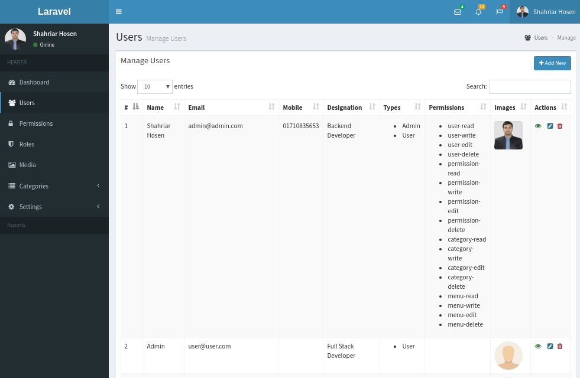
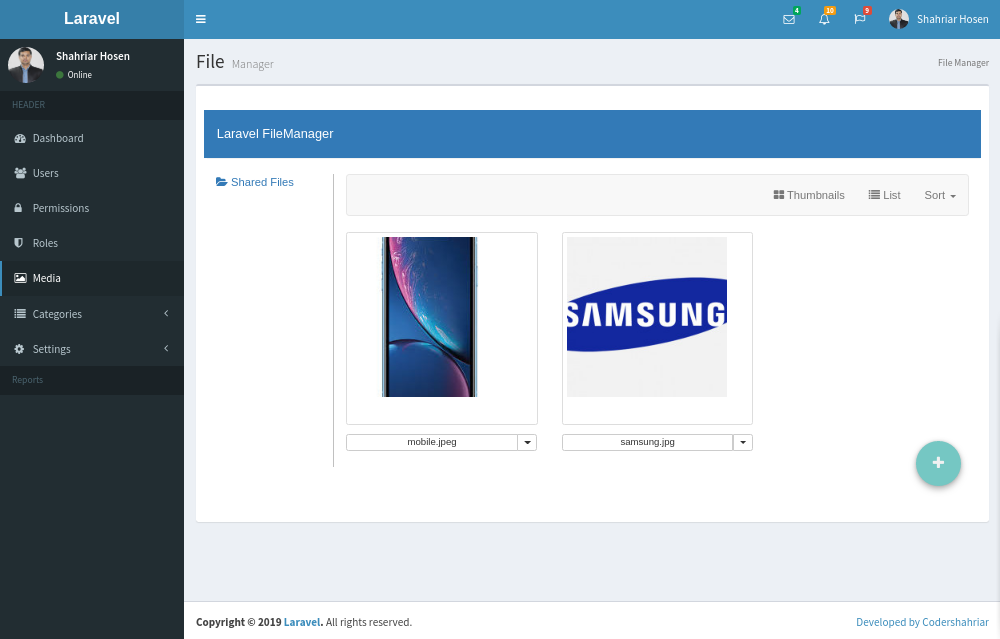
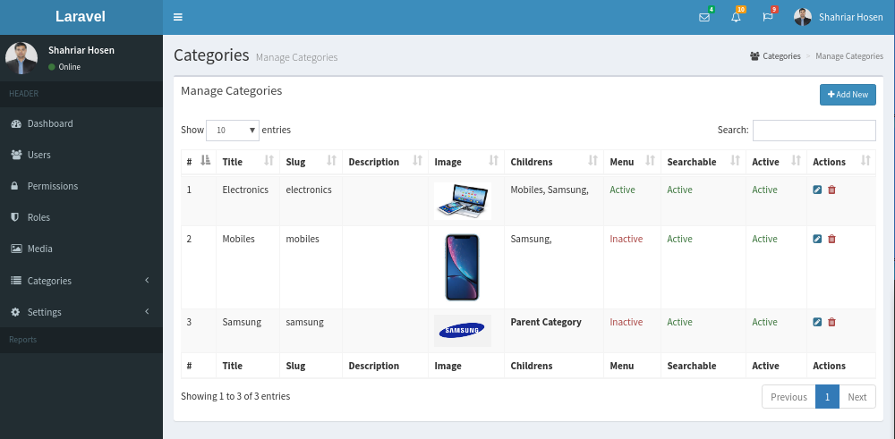
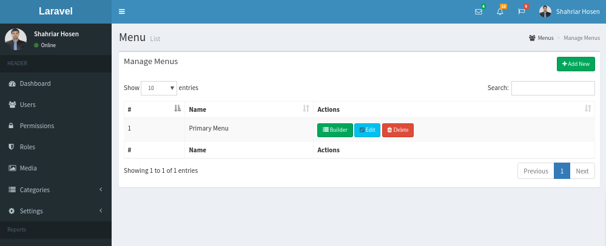
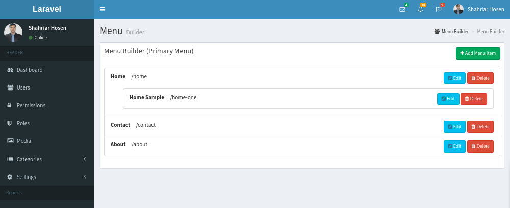

# laravel User Role Permission Base Authentication System with Admin LTE

This is a boilerplate laravel admin panel. I believe anybody can use it, who want to save time.

<pre>
Author : MD Shahriar Hosen 
Email : cse.shahriar.hosen@gmail.com 
URL: http://codershahriar.com </pre>

Version
v1.0.0 beta

Technologies
Laravel v5.8.*
Admin Lte v2

Getting Started
These instructions will get you a copy of the project up and running on your local machine for development and testing purposes. See deployment for notes on how to deploy the project on a live system.

 

 

What things you need to install the software and how to install them

Clone the repo and cd into it

<pre><code>composer install</code></pre>

Rename or copy .env.example file to .env

<pre><code>php artisan key: generate</code></pre>

Set your database credentials in your .env file

<pre><code>php artisan migrate</code></pre>

<pre><code>php artisan db:seed</code></pre>

Set .Env Mail configuration with Gmail

Set social login configuration in .env file  

<pre>FACEBOOK_CLIENT_ID=
FACEBOOK_CLIENT_SECRET= 
FACEBOOK_CLIENT_CALLBACK=</pre>

<pre>GOOGLE_CLIENT_ID=
GOOGLE_CLIENT_SECRET=
GOOGLE_CLIENT_CALLBACK= </pre>

php artisan serve or use Laravel Valet or Laravel Homestead

Visit localhost:8000 in your browser

Visit for admin login /admin/login if you want to access the admin panel. Default Admin User/Password: admin@admin.com/shahriar

Visit user login /login if you want to access the admin panel. Default Admin User/Password: user@user.com/shahriar

{{ 'Happy Coding' }}  

